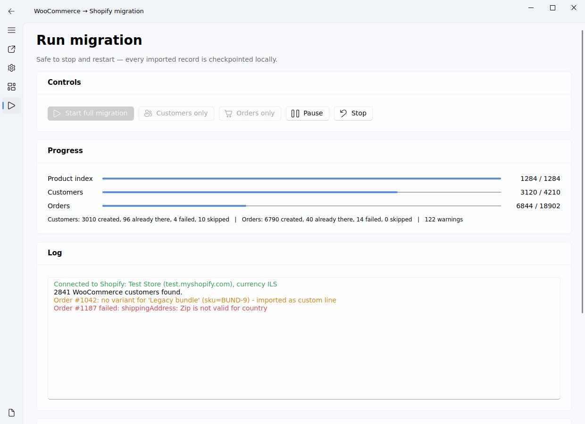

# WooCommerce → Shopify migration (customers & orders)

Moves **customers, WordPress users and order history** out of WooCommerce into Shopify.
Products are assumed to already be in Shopify — order line items are re-linked to the
existing Shopify variants by SKU.

Ships with a PyQt5 / [PyQt-Fluent-Widgets](https://pyqt-fluent-widgets.readthedocs.io/en/latest/)
desktop UI and an equivalent command line interface.



## What gets migrated

| WooCommerce | Shopify |
|---|---|
| Customers (`/wc/v3/customers`) | Customers, with billing + shipping address, phone, tags, note |
| Guest-order buyers | Customers built from the order's billing block |
| WordPress users with no orders (optional) | Customers tagged `wp-user`, `wp-role-<role>` |
| Orders, any status, any date range | Orders created with their original date (`processedAt`) |
| Line items | Matched to Shopify variants by SKU; unmatched lines are kept as custom lines so totals stay correct |
| Fees | Extra custom line items |
| Shipping lines | `shippingLines` |
| Tax lines + "prices include tax" | `taxLines` + `taxesIncluded` |
| Coupons / `discount_total` | A fixed-amount order discount named after the first coupon |
| Payment method + paid date | A successful `SALE` transaction |
| `completed` status | Order marked fulfilled at your primary location |
| `refunded` / partial refunds | `REFUNDED` / `PARTIALLY_REFUNDED` financial status, refunded amount kept in the order attributes |
| Order notes | Appended to the Shopify order note |
| Woo ids, order key, status, IP, coupons | Order custom attributes + `woo_migration` metafields |

Every imported order is tagged `woo-order-<id>` and every customer `woo-customer-<id>`,
so the import is traceable and re-runnable.

## Requirements

* Python 3.9+
* A WooCommerce REST API key (read access is enough):
  *WooCommerce → Settings → Advanced → REST API → Add key*
* A Shopify app (Dev Dashboard) installed on the store, with the scopes
  `write_customers`, `write_orders`, `read_products`, `read_locations` — see
  *Getting the Shopify token* below
* Optional, only to import users who never ordered: a WordPress
  **application password** (*Users → Profile → Application Passwords*)

### Getting the Shopify token

Shopify no longer lets you create admin-made custom apps, and an app built in the
**Dev Dashboard never displays an Admin API token** — it only shows a Client ID and a
Client secret. Pasting either of those into the token field gives
`401 [API] Invalid API key or access token`. They have to be exchanged for a token.

**Use browser OAuth (the authorization code grant) — this is the path for a live store.**

1. In the Dev Dashboard, set the app's **distribution** to **Custom distribution** for your
   store, so it may be installed there.
2. Add `http://localhost:3456/callback` to the app's **allowed redirect URLs**, exactly,
   port included. If Shopify insists the redirect and app URL hosts match, set the app URL
   to `http://localhost:3456` too.
3. Enter the shop domain, Client ID and Client secret on the Connections page and press
   **Browser OAuth (any store)** (CLI: `python -m woo2shopify.cli oauth`). Approve the
   install in the browser.

Shopify may return a permanent token, or a short-lived one (about an hour) plus a 90-day
refresh token. Both are handled: the tool stores whatever it gets, refreshes ahead of
expiry and again if a request comes back 401, and writes the renewed token back to the
config so a migration resumed the next day still works. Refresh tokens rotate, and the new
one is kept.

**Mint token (client credentials) only works on development stores** created in the Dev
Dashboard under the same organization as the app. On a paid or trial store Shopify answers
`shop_not_permitted`, and no app setting changes that — use browser OAuth instead. Where it
does apply it is one request with no browser, and the 24-hour tokens are re-minted
automatically.

Either way the secret only ever travels to `https://<your-shop>.myshopify.com`.

The shop domain field accepts a bare handle (`xzpcy1-7w`), the full myshopify host, or a
pasted URL. It is not the `admin.shopify.com/store/...` address — for
`admin.shopify.com/store/xzpcy1-7w` the domain is `xzpcy1-7w.myshopify.com`.

**Credentials that are not Admin API tokens.** Shopify rejects all of these with the same
opaque 401, so the tool names them instead of letting you guess:

| Starts with | What it actually is |
|---|---|
| `atkn_` | An **App Automation Token** — authenticates Shopify CLI for deploying app versions in CI/CD. It cannot call the Admin API at all. |
| `shpss_` | The app's **Client secret** — exchange it for a token, don't use it as one. |
| `shpca_` | A Customer Account API token. |
| `shppa_` / `prtapi_` | A Partner API token. |

A valid token from the client credentials grant may look like plain hex with no prefix, so
absence of `shpat_` is not itself a problem.

The shop domain field accepts a bare handle (`xzpcy1-7w`), the full myshopify host, or a
pasted URL. It is not the `admin.shopify.com/store/...` address — for
`admin.shopify.com/store/xzpcy1-7w` the domain is `xzpcy1-7w.myshopify.com`.

> Shopify limits how far back apps may create orders. If `orderCreate` rejects old
> orders on your store, ask Shopify support to enable historical order import for the
> app, or switch the **Order API** setting to `rest`.

## Install

```bash
git clone <this repo>
cd transferdatawordpresstoshopify
python -m venv .venv && source .venv/bin/activate   # Windows: .venv\Scripts\activate
pip install -r requirements.txt
```

## Run the UI

```bash
python run_ui.py
```

1. **Connections** – Woo store URL + key/secret, Shopify domain + Admin token. Hit
   *Test WooCommerce* and *Test Shopify*; the Shopify test also fills in your location id.
2. **Options** – how many years of orders (default 4), which statuses, what to include.
   Leave **Dry run** on for the first pass.
3. **Product map** – *Build / refresh index* pulls every Shopify variant's SKU. Do this
   before importing orders, otherwise nothing links to your products.
4. **Run** – *Start full migration*. Pause/stop any time; the run resumes where it stopped.
5. **Reports** – summary, failure list, CSV export.

## Run headless

```bash
python -m woo2shopify.cli init                  # write ~/.woo2shopify/config.json
python -m woo2shopify.cli oauth                 # get an Admin API token (browser, any store)
python -m woo2shopify.cli token                 # client credentials variant (dev stores only)
python -m woo2shopify.cli test                  # check both connections
python -m woo2shopify.cli variants              # build the SKU -> variant index
python -m woo2shopify.cli run --dry-run         # rehearse
python -m woo2shopify.cli run --years 4         # go
python -m woo2shopify.cli run --from 2019-01-01 # or an explicit range
python -m woo2shopify.cli report                # CSVs in ~/.woo2shopify/exports
```

`customers` and `orders` are also available as standalone subcommands.

## How it stays safe to re-run

* Every customer and order is checkpointed in `~/.woo2shopify/state.sqlite3`
  (id, Shopify gid, status, error). A second run skips what already succeeded.
* Before creating an order the tool also searches Shopify for `tag:woo-order-<id>`,
  so a fresh state file still won't produce duplicates.
* Customers are deduplicated by email — an "email has already been taken" error is
  resolved by looking the existing customer up and reusing it.
* Inventory behaviour defaults to `BYPASS` and receipts are off, so importing history
  does not move stock levels or email your customers.

## Suggested order of work

1. Products first (you have done this).
2. `variants` — build the SKU index.
3. `run --dry-run` over a short range, read the log for `no variant for …` warnings and
   fix SKUs on the Shopify side.
4. Customers, then orders, oldest to newest.
5. Check the Reports page, re-run to retry failures.

## Choosing which orders come across

The Options page's **Order statuses** card lists every status your store actually uses —
press **Refresh from store** to replace the guessed list with the real one, custom
statuses from a plugin included, each with its live order count. Only ticked statuses are
imported. By default `completed`, `processing`, `on-hold` and `refunded` are ticked;
`cancelled`, `failed`, `pending` and anything unrecognised start unticked — tick them in if
you want them. `Select all` / `Select none` are there for a quick sweep. A refresh keeps
whatever you already had ticked (matched by status slug), so it's safe to press again later
in a run if new statuses show up.

## SKU matching

A SKU that fails an exact match is retried against a couple of safe, automatic variants
before falling back to a custom line item: a trailing parenthetical is stripped (Woo's
`MISHEE-1 (מוצר 1)` against Shopify's `MISHEE-1`, a common symptom of a translated or
duplicated product), then just the first whitespace-separated token. The exact SKU is
always tried first and preferred; nothing here invents a match — if none of the candidates
hit an indexed Shopify SKU, the warning fires as before. A log line shows when a match came
from normalisation rather than the exact SKU, so you can go clean up that SKU in Woo if
you'd rather.

## Order-creation throttling

Shopify limits how fast `orderCreate`/`customerCreate` can run on a bucket separate from
the general GraphQL cost budget, and reports hitting it as a data error —
`Too many attempts. Please try again later.` — not an HTTP 429. The tool recognises that
specific message and retries with backoff (up to `Max retries` in Options); a real data
error (a bad email, an invalid address) is never retried, only this one. On top of retrying, the tool paces itself: after a throttle it starts spacing writes out
(up to 8s apart), and eases back off after 25 clean writes in a row — so a long run adapts
instead of hitting the same wall every few orders. If you still see it exhaust retries,
raise **Extra delay between writes** in Options a few hundred ms too.

## Location ID, and why an order might come in unfulfilled

Leave this blank — the tool auto-detects a location on *Test Shopify* and again at the
start of a run, preferring one that is active and set to fulfil online orders. If it has
to fall back to a less suitable one, or finds none at all, that's logged explicitly rather
than left for you to notice later in Shopify — check the Run log (or press *Test Shopify*)
for a line starting "Fulfilment location:" or "No fulfilment location available". Without
one, every order imports unfulfilled regardless of its WooCommerce status; fulfilment
otherwise only applies to orders whose Woo status is `completed`.

If you fill the field in yourself it must be exactly `gid://shopify/Location/<number>`;
anything else (a pasted URL, an admin link) is detected and dropped with a warning rather
than sent to Shopify.

## Scopes, and why a run can stop immediately

Before touching anything the tool asks Shopify which scopes the token actually carries
(`currentAppInstallation.accessScopes`) and compares them against what the chosen options
need — `write_customers`, `write_orders`, `read_products` for SKU matching, `read_locations`
for fulfilments. A `write_` scope satisfies the matching `read_` requirement. If any are
missing the run stops in the first second and names them, rather than failing minutes in
with `Access denied for productVariants field`.

Scopes live on the **app version**. Adding them is not enough: the version has to be
**released**, and a new token minted afterwards — an existing token keeps the scopes it was
issued with. *Test Shopify* prints the granted scopes so you can check before starting.

## Known limits

* Refunds are recorded as a financial status plus the refunded amount in the order
  attributes — individual refund transactions and restocks are not recreated.
* Subscriptions, memberships and other Woo plugin data are out of scope.
* Order numbers are Shopify's own unless *Keep the WooCommerce order number* is on;
  the Woo number is always stored in the order attributes and metafields either way.
* Non-E.164 phone numbers are dropped from the customer record (kept on the address).

## Tests

```bash
python -m unittest discover -s tests -t .
```

Runs a full migration against a local mock of both APIs — customer creation, guest
orders, SKU matching, taxes, discounts, refunds, dry run, resume, and the REST fallback —
plus both token flows, token refresh and rotation, the 401 retry and the
wrong-credential guards (`tests.test_oauth`).
